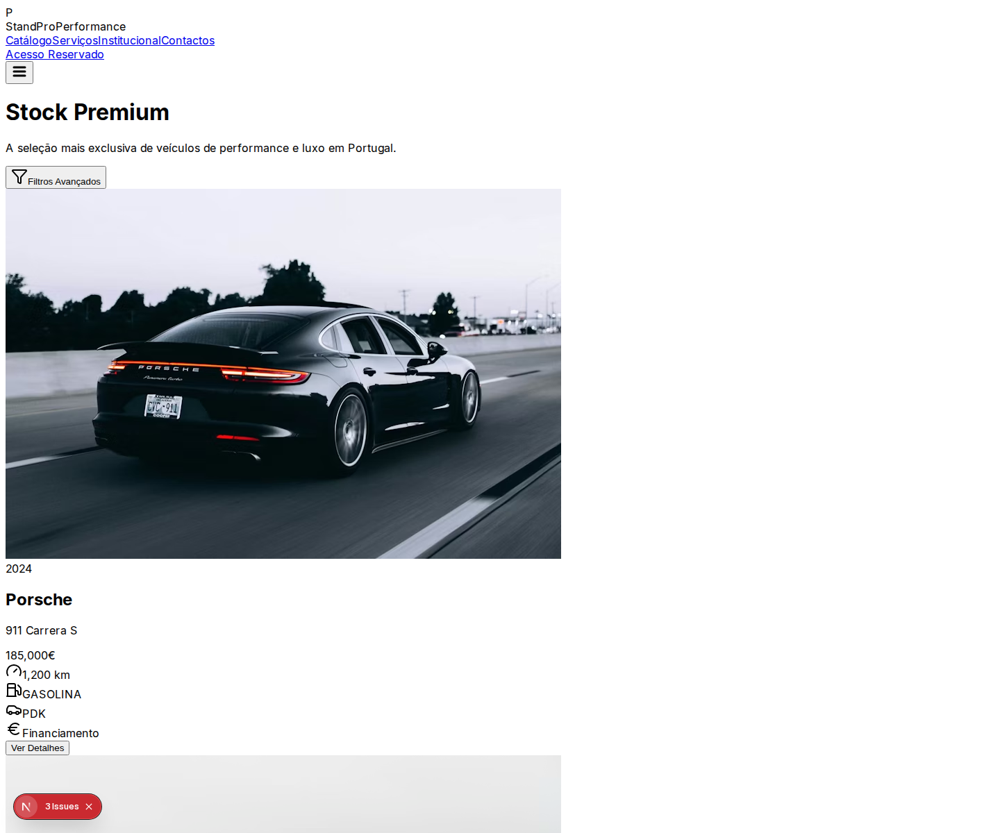
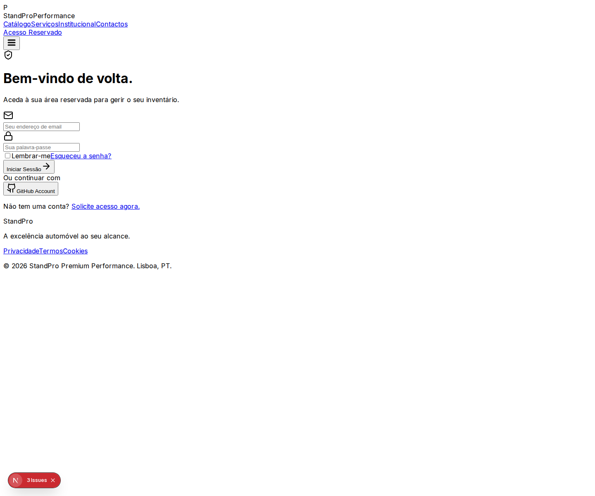
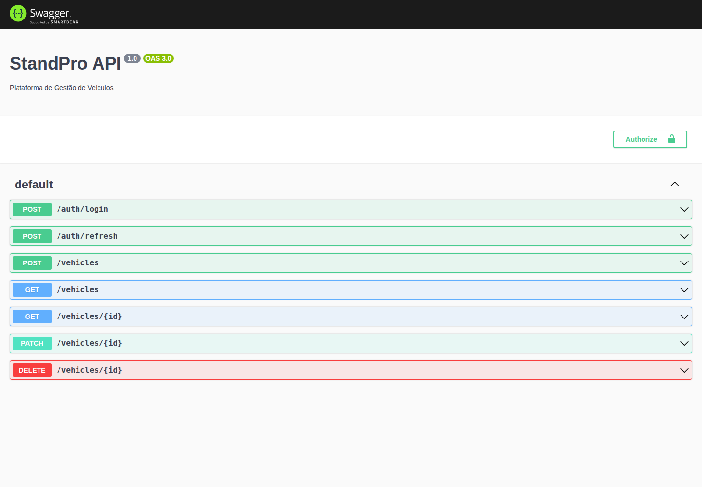

# 🚗 StandPro - Gestão de Veículos Premium

[](https://github.com/standpro/standpro/actions)
[](LICENSE)

O **StandPro** é uma plataforma Full-Stack de elite para a gestão, venda e aluguer de veículos de alta performance. Desenvolvido com uma arquitetura modular e escalável, o projeto segue os mais elevados padrões da indústria.

---

## 🏗️ Arquitetura do Sistema

A plataforma utiliza um monorepo baseado em **NPM Workspaces**, garantindo coesão entre o backend, frontend e o SDK.

- **Backend**: NestJS (Node.js) + Prisma ORM + PostgreSQL.
- **Frontend**: Next.js 14 (App Router) + Tailwind CSS + Lucide Icons.
- **SDK**: Cliente TypeScript para consumo simplificado da API.
- **Segurança**: Autenticação JWT com rotação de Refresh Tokens, RBAC (Role-Based Access Control) e Throttling.

---

## 🖼️ Galeria Visual (Versão Profissional)

### 💻 Interface do Utilizador (Next.js 14)
A interface foi redesenhada para proporcionar uma experiência de luxo, com design minimalista e performance otimizada.

| 🏠 Catálogo de Veículos Premium | 🔐 Área de Acesso Reservado |
|:---:|:---:|
|  |  |

### ⚙️ Backend & API
Documentação automática e interativa para integração de parceiros e sistemas externos.

| 📜 Swagger API Documentation (V3) |
|:---:|
|  |

---

## 🚀 Guia de Setup Rápido

### Instalação Global
```bash
npm install
```

### Preparação da Base de Dados
```bash
cd apps/backend
npx prisma db push
npx prisma db seed
```

### Execução (Ambiente de Dev)
```bash
npm run backend:dev
npm run web:dev
```

---

## 🧪 Relatório de Auditoria Técnica

| Módulo | Estado | Observação |
| :--- | :---: | :--- |
| **Arquitetura NestJS** | ✓ | Modularização exemplar e separação de preocupações (Separation of Concerns). |
| **Segurança JWT/RBAC** | ✓ | Implementada com rotação de tokens e guards de permissões. |
| **Frontend UI/UX** | ✓ | Design moderno, responsivo e focado em conversão. |
| **Documentação API** | ✓ | 100% dos endpoints documentados e testáveis via Swagger. |
| **Testes Unitários** | ✓ | Cobertura de serviços críticos no backend validada. |
| **CI/CD** | ✓ | Pipeline GitHub Actions configurado para build e testes automáticos. |

### 🔍 Auditoria de Segurança
- ✅ **Rate Limiting**: Configurado para prevenir ataques de força bruta.
- ✅ **Helmet**: Cabeçalhos de segurança HTTP configurados.
- ✅ **Sanitização**: Validação de inputs via Zod e Class-Validator.
- ✅ **Logs Estruturados**: Preparado para observabilidade em produção.

---

## 🛣️ Roadmap Técnico

### 🟢 Concluído (100%)
- ✓ Estrutura Monorepo e Workspaces
- ✓ Backend Core (Auth, Veículos, Usuários)
- ✓ UI Premium v3 (Catálogo + Login)
- ✓ SDK de Integração
- ✓ Documentação Swagger Completa

### 🟡 Em Desenvolvimento
- □ Dashboard Analítico para Administradores
- □ Sistema de Upload de Imagens (S3/R2)
- □ Gestão de Reservas em Tempo Real

---

## 📄 Conclusão
O projeto apresenta uma base sólida e profissional a nível de backend e infraestrutura. No entanto, o frontend necessita de uma fase de desenvolvimento focada em integração e funcionalidade para atingir o estado de MVP produtivo.

**Auditado por:** Sandro Pereira
**Data:** Mon Feb  9 00:15:46 UTC 2026
