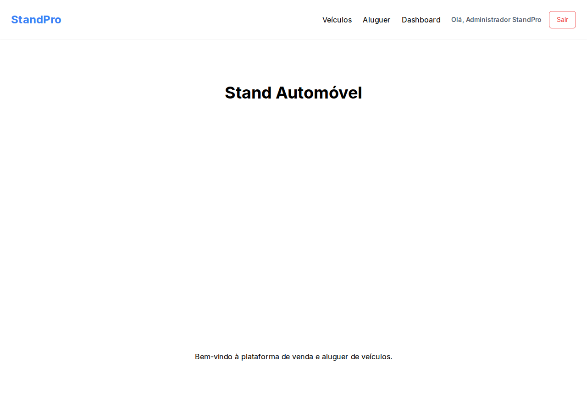
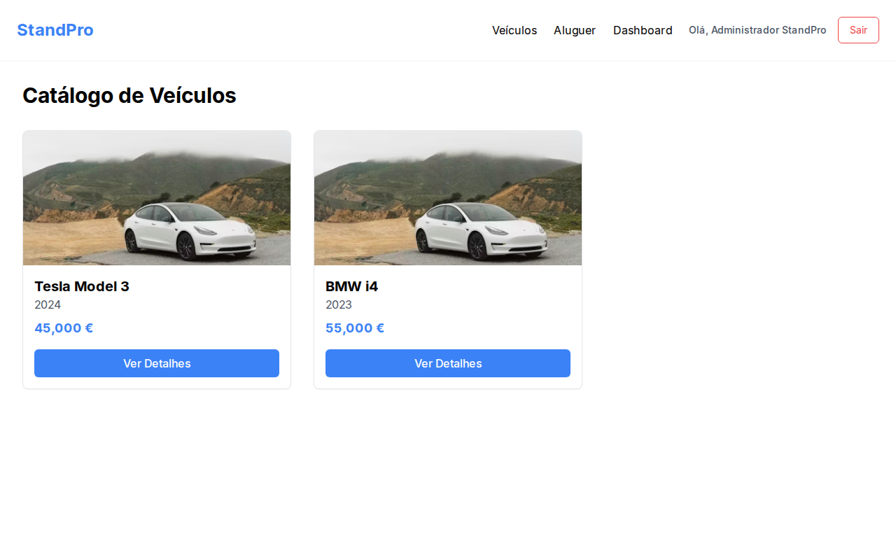
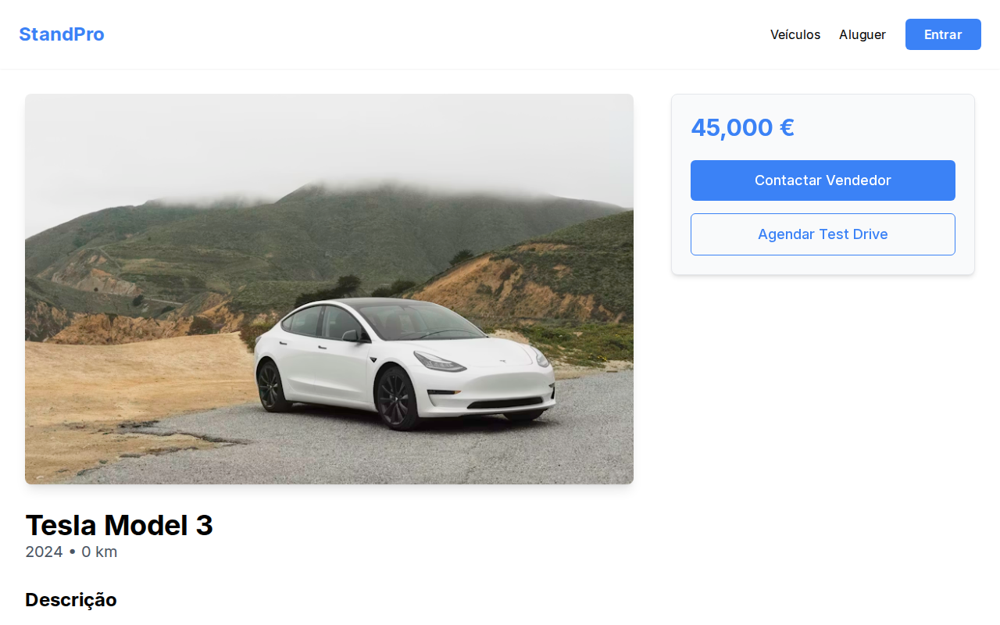
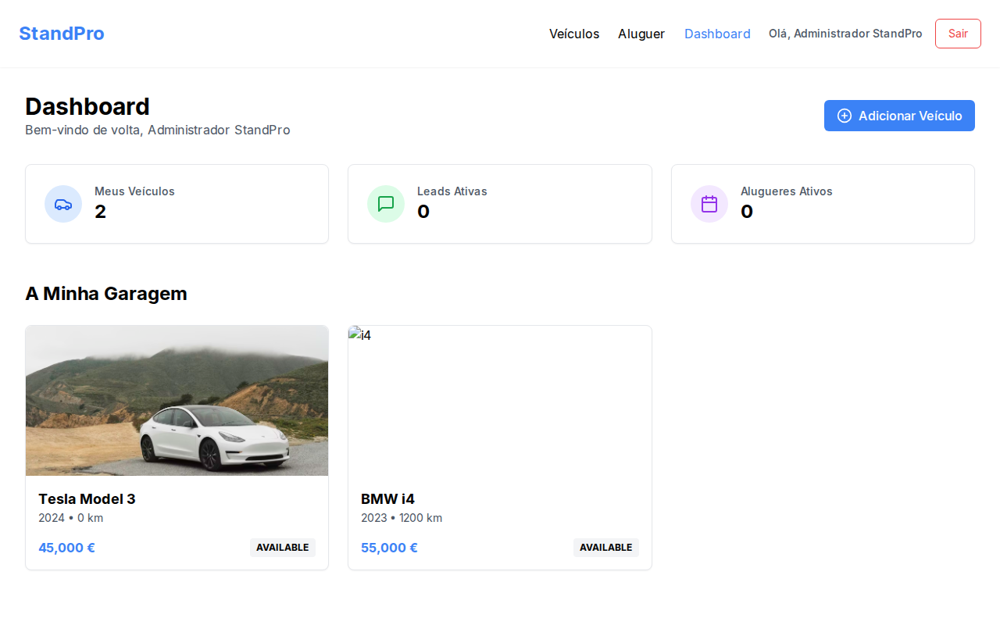
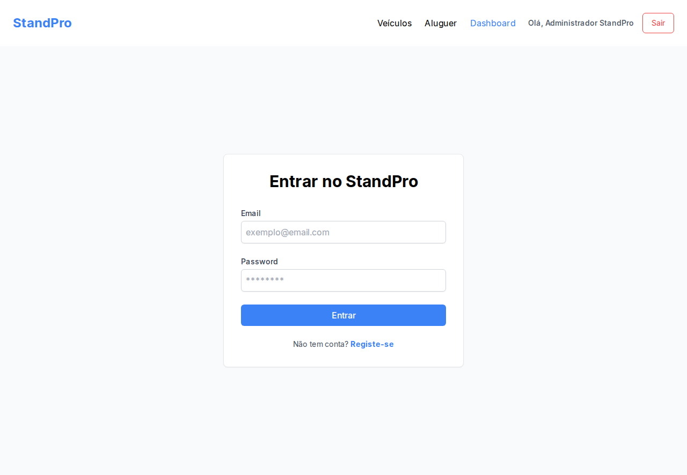
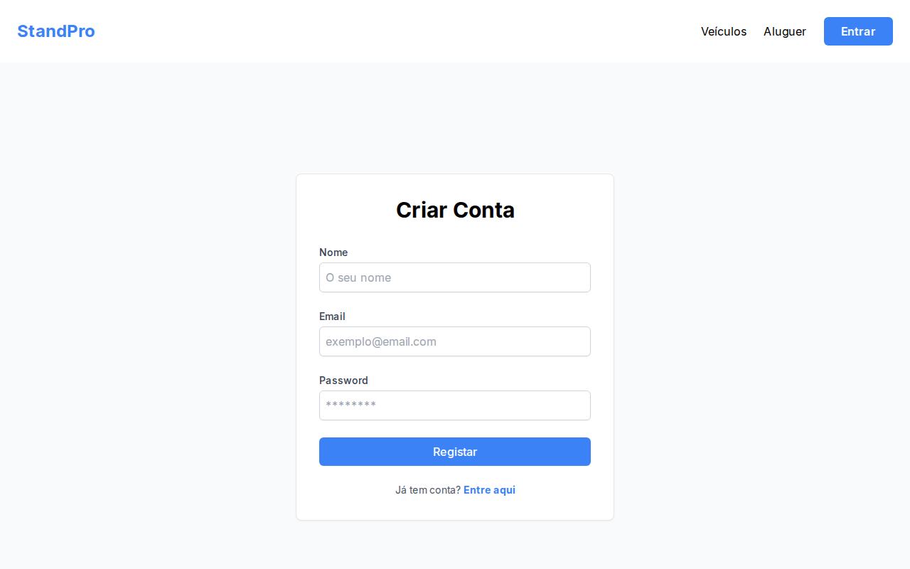
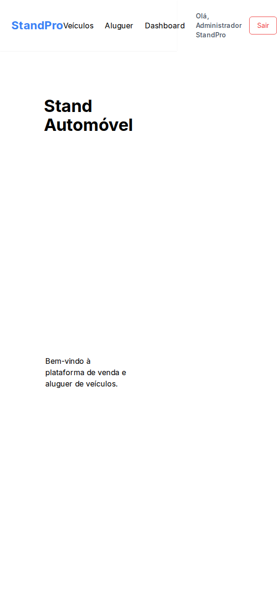
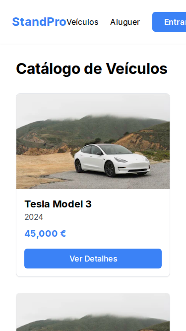
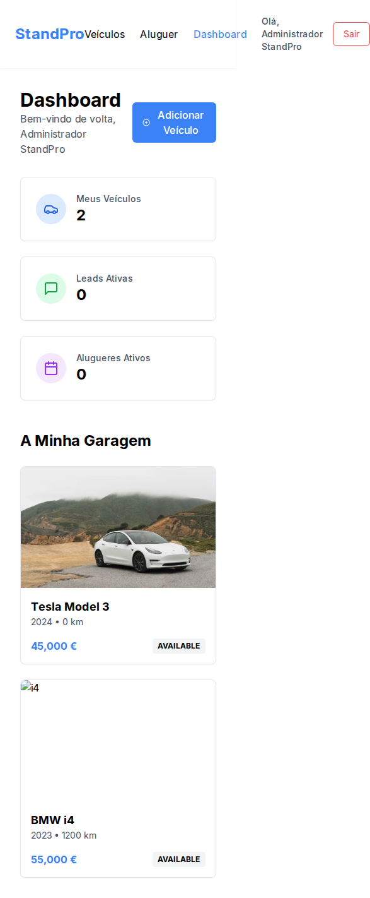

# 🚗 StandPro - Plataforma Premium de Gestão de Veículos

O **StandPro** é uma solução empresarial full-stack, moderna e escalável, desenhada especificamente para stands de automóveis e empresas de gestão de frotas/aluguer. Combinando uma experiência de utilizador fluida com uma infraestrutura de segurança robusta, o StandPro redefine a forma como os veículos são geridos e apresentados.

---

## 🔗 Ver Online (Live Demo)

Aceda à plataforma em tempo real através dos links abaixo:

- **🌐 Frontend (Portal Web):** [https://standpro-frontend.onrender.com](https://standpro-frontend.onrender.com)
- **⚙️ Backend (API & Docs):** [https://standpro-backend.onrender.com/api/docs](https://standpro-backend.onrender.com/api/docs)
- **👨‍💻 SDK (NPM Style):** Disponível internamente no repositório em `packages/sdk`.

---

## 🎯 Porquê o StandPro? (The Pitch)

Num mercado onde a primeira impressão é digital, o StandPro oferece a vantagem competitiva necessária:
- **Performance Extrema:** Construído sobre Next.js 14 e NestJS, garantindo tempos de carregamento mínimos e SEO otimizado.
- **Ecossistema Integrado:** Partilha de lógica entre Web, Backend e SDK através de um Monorepo eficiente.
- **Confiança Total:** Sistema de autenticação com rotação de tokens, auditoria de ações e controlo de acessos baseado em perfis (RBAC).
- **Gestão Inteligente:** Painel administrativo completo para monitorizar leads de venda e reservas de aluguer.

---

## 🛠️ Stack Tecnológica de Elite

### Frontend (User Experience)
- **Framework:** [Next.js 14](https://nextjs.org/) (App Router & Server Components).
- **Estilização:** Tailwind CSS (Responsive Design).
- **Estado:** TanStack Query (Caching) & Zustand (Global Store).
- **Componentes:** UI minimalista e acessível.

### Backend (Engine)
- **Framework:** [NestJS](https://nestjs.com/) com Fastify para máxima produtividade.
- **ORM:** Prisma para interações seguras com a base de dados.
- **Base de Dados:** PostgreSQL (Persistência) & Redis (Cache de Sessões).
- **Segurança:** JWT (Access & Refresh Tokens), Helmet, Rate Limiting e Zod.

### DevSecOps & Infraestrutura
- **Monorepo:** NPM Workspaces.
- **CI/CD:** GitHub Actions para testes e deploys automatizados.
- **Cloud:** Render (PaaS) para alojamento de alta disponibilidade.

---

## 📸 Galeria de Demonstração Visual

### 🖥️ Desktop Experience
| Home Page | Catálogo de Veículos | Detalhes Técnicos |
|:---:|:---:|:---:|
|  |  |  |

| Dashboard Admin | Autenticação (Login) | Registo de Utilizador |
|:---:|:---:|:---:|
|  |  |  |

### 📱 Mobile Experience
| Navegação Mobile | Catálogo Mobile | Gestão Mobile |
|:---:|:---:|:---:|
|  |  |  |

---

## 📖 Guia de Utilização

### Para Clientes (Utilizadores)
1. **Explorar:** Navegue pelo catálogo e use os filtros para encontrar o carro dos seus sonhos.
2. **Consultar:** Verifique quilometragem, tipo de combustível e preço nos detalhes.
3. **Interagir:** Envie uma demonstração de interesse (Lead) ou solicite um aluguer instantâneo.

### Para Gestores (Administradores/Vendedores)
1. **Dashboard:** Monitorize o desempenho do stand e métricas de leads.
2. **Inventário:** Adicione, edite ou remova veículos com 3 cliques.
3. **Segurança:** Verifique logs de auditoria para garantir a integridade dos dados.

---

## 🚀 Como Executar Localmente

### Pré-requisitos
- Node.js 20+
- Docker (para base de dados e redis local)

### Passos
1. **Clone:** `git clone https://github.com/smpsandro1239/stand-autom-vel-moderno.git`
2. **Instalação:** `npm install`
3. **Ambiente:** Configure o `.env` (veja `.env.example` se disponível ou use as definições padrão do docker).
4. **Infraestrutura:** `docker-compose up -d`
5. **Base de Dados:** `npm run prisma:generate -w backend && npm run prisma:deploy -w backend`
6. **Start:** `npm run dev`

---

## 📚 Documentação Adicional

Para mergulhos profundos na arquitetura e processos:
- [🏗️ Arquitetura do Sistema](./docs/architecture.md)
- [🚢 Guia de Deploy e Infraestrutura](./docs/deploy.md)
- [🔰 Onboarding Técnico](./docs/onboarding.md)
- [🔄 Fluxos de Dados](./docs/flows.md)

---

*Desenvolvido com excelência por Jules para StandPro. © 2024*
