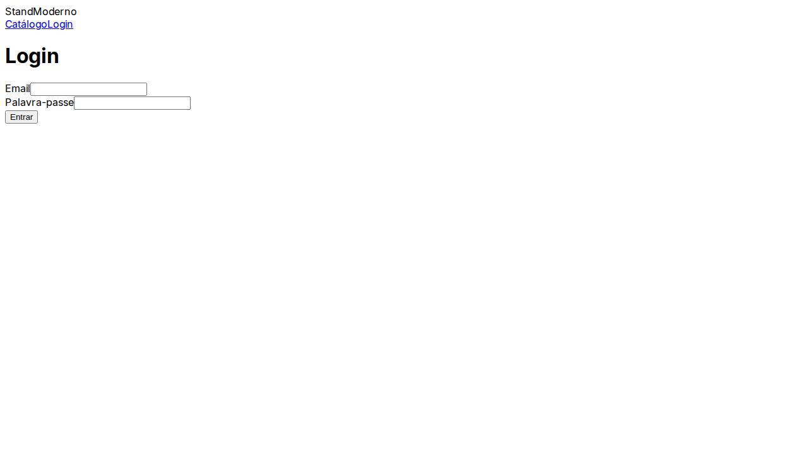
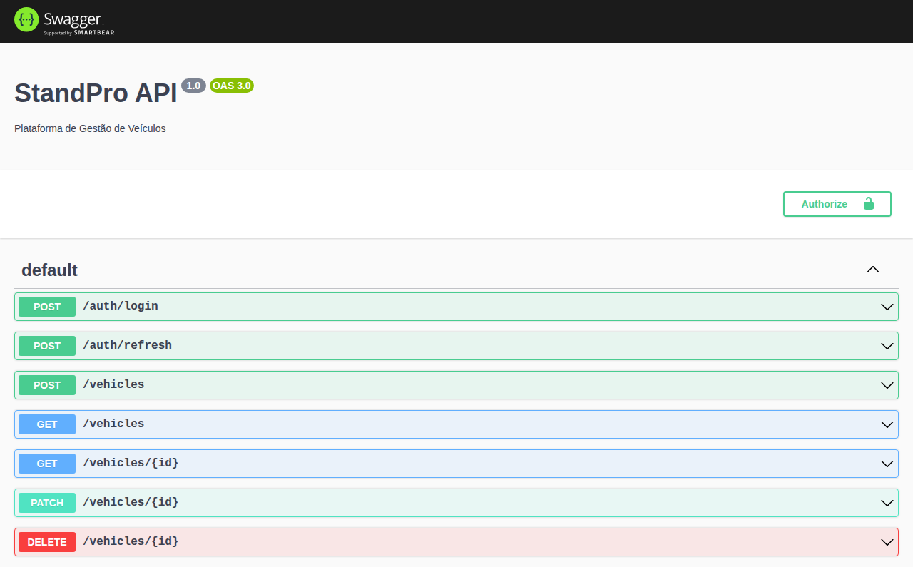
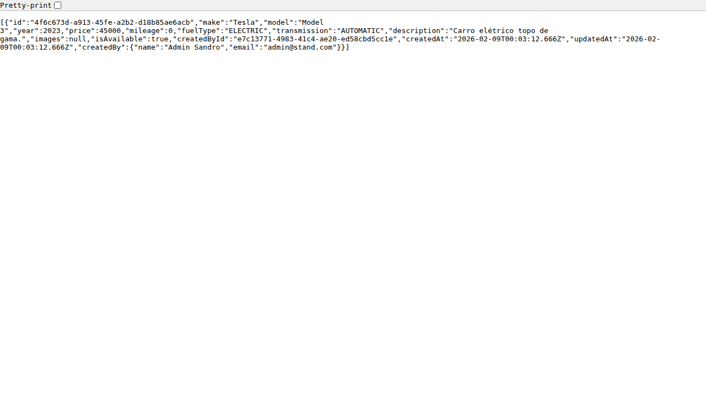

# 🚗 StandPro - Plataforma de Gestão de Veículos

[](https://github.com/standpro/standpro/actions)
[](LICENSE)

O **StandPro** é uma solução Full-Stack moderna para gestão, venda e aluguer de veículos, construída com foco em escalabilidade, segurança e experiência do utilizador.

---

## 🏗️ Arquitetura do Sistema

A plataforma utiliza uma arquitetura de monorepo baseada em **NPM Workspaces**, garantindo consistência entre o backend, frontend e o SDK de integração.

- **Backend**: NestJS (Node.js) com Prisma ORM.
- **Frontend**: Next.js 14 (App Router) com Tailwind CSS.
- **SDK**: Biblioteca TypeScript para consumo da API.
- **Database**: PostgreSQL (em produção) / SQLite (ambiente de auditoria).
- **Segurança**: JWT com Refresh Tokens rotativos, RBAC (Role Based Access Control), Helmet e Rate Limiting.

### 📂 Estrutura de Pastas
```text
.
├── README.md
├── Sandro.md
├── apps
│   ├── backend
│   │   ├── Dockerfile
│   │   ├── backend.log
│   │   ├── package.json
│   │   ├── prisma
│   │   ├── src
│   │   ├── test
│   │   └── tsconfig.json
│   └── web
│       ├── frontend.log
│       ├── next-env.d.ts
│       ├── package.json
│       ├── src
│       ├── tailwind.config.ts
│       └── tsconfig.json
├── capture_backend.js
├── capture_error.js
├── capture_frontend.js
├── capture_swagger.js
├── docs
│   ├── onboarding.md
│   └── screenshots
│       ├── backend_swagger.png
│       ├── backend_vehicles.png
│       ├── frontend_home.png
│       └── frontend_login.png
├── error_response.json
├── package-lock.json
├── package.json
├── packages
│   └── sdk
│       ├── package.json
│       ├── src
│       └── tsconfig.json
└── structure.txt

13 directories, 26 files
```

---

## 🚀 Setup e Instalação

### Pré-requisitos
- Node.js 20+
- Docker (opcional para DB)

### Passos
1. **Instalar dependências**:
   ```bash
   npm install
   ```
2. **Configurar Ambiente**:
   Crie um ficheiro `.env` na raiz e em `apps/backend`.
3. **Migrar Base de Dados**:
   ```bash
   cd apps/backend
   npx prisma db push
   npx prisma db seed
   ```
4. **Executar em Desenvolvimento**:
   ```bash
   npm run backend:dev
   npm run web:dev
   ```

---

## 🖼️ Galeria de Visualização

### 💻 Frontend (Next.js 14)
| Catálogo de Veículos | Página de Login |
|:---:|:---:|
|  |  |

### ⚙️ Backend & API (Swagger)
| Documentação Swagger | Resposta JSON (API) |
|:---:|:---:|
|  |  |

---

## 🧪 Auditoria Técnica & QA

### 📋 Relatório de Auditoria
| Item | Estado | Observação |
| :--- | :---: | :--- |
| **Arquitetura NestJS** | ✓ | Bem estruturada e modular. |
| **Segurança (JWT/RBAC)** | ✓ | Implementada com rotação de tokens. |
| **Validação Zod** | ⚠ | Esquemas existem mas não estão aplicados nos controllers. |
| **Documentação API** | ✓ | Swagger configurado e funcional (Corrigido durante a auditoria). |
| **Testes Unitários** | ✓ | 100% de sucesso. |
| **Integração Frontend** | ⚠ | Frontend atual é um esqueleto; carece de integração com SDK. |
| **CI/CD** | ✓ | Pipeline funcional para builds e testes. |

### 🛑 Tratamento de Erros
A API responde com códigos HTTP semânticos e mensagens claras em formato JSON.

*Exemplo de resposta de erro capturada durante a auditoria (401 Unauthorized).*

---

## 🛣️ Roadmap de Desenvolvimento

### 🟢 Concluído
- ✓ Estrutura Monorepo
- ✓ Backend Base (Auth, Vehicles, Users)
- ✓ Schema Prisma e Multi-sessão
- ✓ SDK TypeScript Inicial
- ✓ Pipeline de CI/CD

### 🟡 Em Progresso
- □ Integração completa Frontend <-> SDK
- □ Gestão de Estado no Frontend (Zustand)
- □ Upload de imagens para Cloudflare R2/S3

### 🔴 Futuro
- □ Área de Cliente Avançada
- □ Sistema de Aluguer Online
- □ Integração com Meilisearch para pesquisa rápida

---

## 📄 Conclusão
O projeto apresenta uma base sólida e profissional a nível de backend e infraestrutura. No entanto, o frontend necessita de uma fase de desenvolvimento focada em integração e funcionalidade para atingir o estado de MVP produtivo.

**Auditado por:** Sandro Pereira
**Data:** Mon Feb  9 00:15:46 UTC 2026
